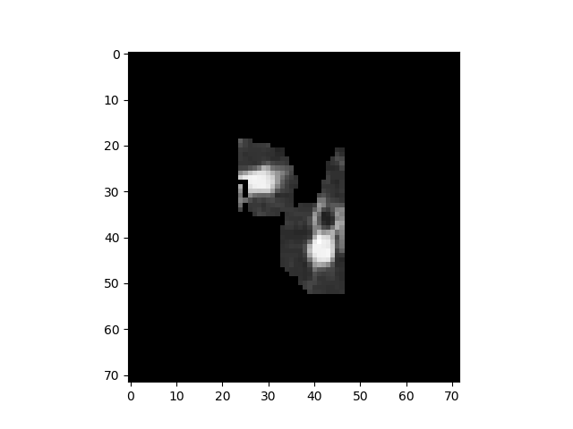
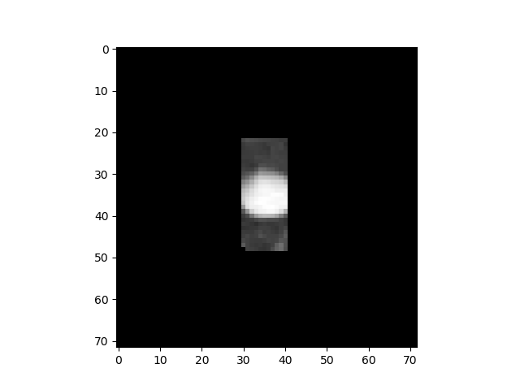
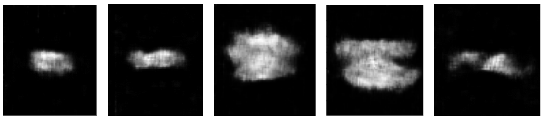

# Semi-Supervised-Learning-To-Improve-Lung-Cancer-Detection
Boost lung Cancer Detection using Generative model and Semi-Supervised Learning

## Dataset Used for Training

-   LUNA16 dataset (https://luna16.grand-challenge.org/download/)
-   Kaggle Data Science Bowl 2017 (https://www.kaggle.com/c/data-science-bowl-2017/data)

## Architecture

## Results

### Nodule Detector Results

    

### Generator Results

### Classifier Results

| Method                        | Accuracy          |
| ----------------------------- |:-----------------:|
| **Supervised Learning**       | 64 %              |
| **Semi-Supervised Learning**  | **87.3 %**        |

## Resources

- **Kaggle Data Science Bowl 2017 Kernel** [[link]](https://www.kaggle.com/c/data-science-bowl-2017/kernels)
- **Luna2016-Lung-Nodule-Detection** [[link]](https://github.com/codedecde/Luna2016-Lung-Nodule-Detection)
- **Semi-supervised learning GAN in Tensorflow** [[link]](https://github.com/gitlimlab/SSGAN-Tensorflow)
- **DSB2017** [[link]](https://github.com/lfz/DSB2017)
- **Keras-GAN** [[link]](https://github.com/eriklindernoren/Keras-GAN)
- **Building powerful image classification models using very little data** [[link]](https://blog.keras.io/building-powerful-image-classification-models-using-very-little-data.html)

## Contributors:
 1. Dhamodhran ([@svella9](https://github.com/svella9))
 2. Siddharth R Koti ([siddharthkoti](https://github.com/siddharthkoti))
 3. Vijay M Mundaragi ([Vijay-Mundaragi](https://github.com/Vijay-Mundaragi))
